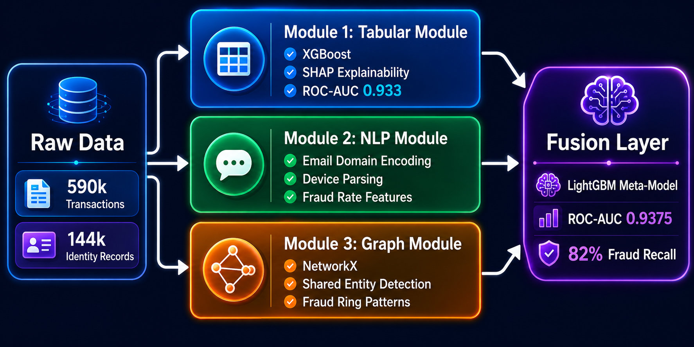
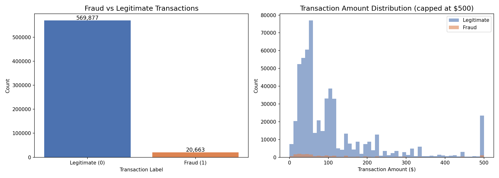
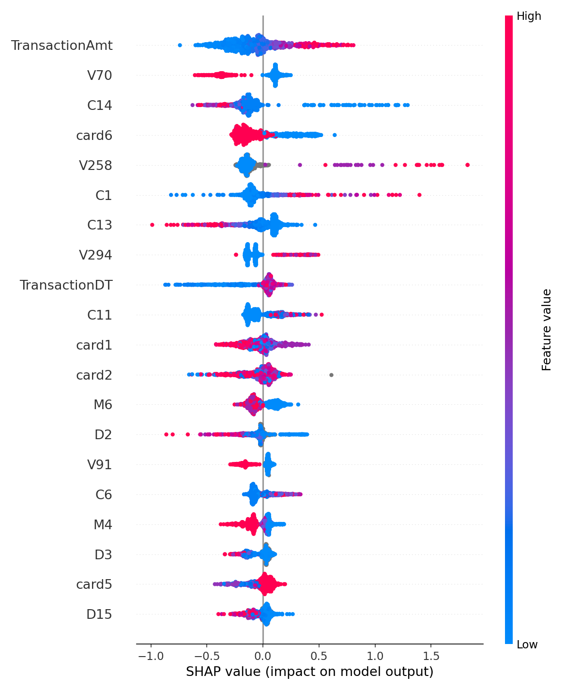
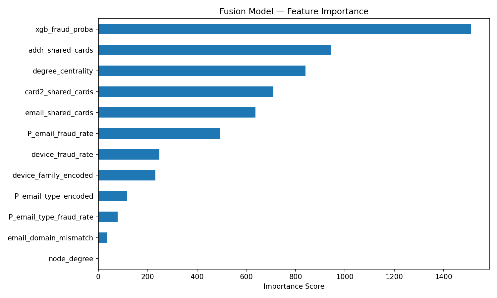

# Multimodal Fraud Detection: Tabular + NLP + Graph


A three-module fraud detection system that combines structured transaction features, 
text-derived signals from email domains and device types, and a transaction network graph 
— each module catches patterns the others miss.

> "Most fraud detection looks at numbers. Real fraud hides in the text and the network. 
> This system looks at all three."

---

## Overview

Most fraud detection systems treat every transaction as an isolated row of numbers. 
Real fraud doesn't work that way — fraudsters reuse addresses, hide behind legitimate 
email providers, and operate in networks of linked accounts.

This project builds three independent detection engines, each looking at the problem 
from a different angle, then fuses their signals into a single model.

| Module | Approach | Key Signal |
|--------|----------|------------|
| Tabular | XGBoost on 429 structured features | Transaction amount, account linkage counts |
| NLP | Email domain + device string parsing | Domain fraud rates, device family risk |
| Graph | NetworkX transaction network | Address reuse, card clustering patterns |
| Fusion | LightGBM meta-model | All three signals combined |

---

## Architecture



The raw data flows into three parallel modules. Each module produces a set of features 
or a probability score. The fusion layer learns how to weight all three signal sources 
against each other to make the final fraud decision.

---

## Dataset

**Source:** [IEEE-CIS Fraud Detection](https://www.kaggle.com/datasets/lnasiri007/ieeecis-fraud-detection) — Kaggle

| File | Rows | Columns | Description |
|------|------|---------|-------------|
| train_transaction.csv | 590,540 | 394 | Core transaction features, fraud labels |
| train_identity.csv | 144,233 | 41 | Device and identity attributes |
| **Merged** | **590,540** | **434** | Left join on TransactionID |

**Key characteristics:**
- **3.5% fraud rate** — significant class imbalance handled via `scale_pos_weight` in XGBoost and LightGBM
- Only 144k of 590k transactions have identity records — identity columns are null where unavailable, handled natively by tree models
- 174 of 394 transaction columns have >50% nulls — V-series Vesta engineered features, evaluated via feature importance rather than dropped blindly

**Column groups:**

| Group | Columns | Description |
|-------|---------|-------------|
| Core | TransactionAmt, ProductCD | Transaction amount and product type |
| Card | card1–card6 | Payment card attributes |
| Address | addr1, addr2 | Billing address regions |
| Email | P_emaildomain, R_emaildomain | Purchaser and recipient email domains |
| Count | C1–C14 | Linked cards and addresses per account |
| Time Delta | D1–D15 | Days since previous transactions |
| Match | M1–M9 | Name and address verification flags |
| Vesta | V1–V339 | Engineered features from Vesta's fraud system |
| Identity | id_01–id_38, DeviceType, DeviceInfo | Device fingerprint and network info |

> The dataset is not included in this repo due to size. Download from Kaggle and place 
> `train_transaction.csv` and `train_identity.csv` in the project root.

---

## Exploratory Data Analysis



- **Class imbalance is severe** — 569,877 legitimate transactions vs 20,663 fraud (3.5% fraud rate)
- **Fraud transactions cluster at lower amounts** — legitimate transactions spread across a wider range, while fraud concentrates under $100
- High-value fraud does exist but is rare — the long tail of legitimate transactions makes amount alone insufficient as a fraud signal

---

## Modules

### Module 1: Tabular (XGBoost)
`notebooks/02_tabular_model.ipynb`

The foundation of the system. 429 structured features — card attributes, transaction 
amounts, count features, time deltas, and Vesta engineered features — fed into an 
XGBoost classifier.

**Key decisions:**
- Class imbalance handled via `scale_pos_weight = 27.58` (ratio of legitimate to fraud transactions) — no SMOTE, faster and equally effective with XGBoost
- SHAP explainability layer added to interpret individual predictions
- Model probability score saved as a feature for the fusion layer

**Results:**

| Metric | Value |
|--------|-------|
| ROC-AUC | 0.933 |
| Fraud Recall | 0.81 |
| Fraud Precision | 0.24 |

**Top SHAP signals:**



- High `TransactionAmt` pushes strongly toward fraud
- High `C14` (linked account count) signals fraud ring behavior
- Low `V70` values correlate with fraudulent transactions

---

### Module 2: NLP (Email + Device)
`notebooks/03_nlp_module.ipynb`

Extracts fraud signal from three text columns ignored by the tabular model: 
`P_emaildomain`, `R_emaildomain`, and `DeviceInfo`.

**Email domain features:**
- `P_email_fraud_rate` — target-encoded fraud rate per domain
- `P_email_type_fraud_rate` — fraud rate by domain category (free / corporate / anonymous / unknown)
- `email_domain_mismatch` — flag where purchaser and recipient domains differ
- Key finding: free providers (gmail, yahoo) have **higher** fraud rates (3.8%) than anonymous domains (2.6%) — fraudsters use real emails

**Device features:**
- Raw `DeviceInfo` strings parsed into clean device families (Windows, iOS, Samsung Android, Huawei Android, Firefox, IE, etc.)
- `device_fraud_rate` — target-encoded fraud rate per device family
- Key finding: Huawei Android (13.6%) and Samsung Android (11.5%) have 3-4x the average fraud rate — prepaid Android devices are commonly used in fraud rings

---

### Module 3: Graph (NetworkX)
`notebooks/04_graph_module.ipynb`

Builds a transaction network where card identifiers are nodes and edges connect cards 
that share the same address, email domain, or card type. Captures fraud ring patterns 
invisible to row-by-row models.

**Graph structure:**
- 14,447 nodes, 97,979 edges
- Node types: card1, card2, addr1, P_emaildomain (prefixed to avoid collisions)

**Features engineered:**
- `degree_centrality` — how connected each card node is in the network
- `addr_shared_cards` — how many unique cards share the same address
- `email_shared_cards` — how many unique cards share the same email domain
- `card2_shared_cards` — how many unique cards share the same card2 value

**Key finding:** Fraud transactions come from addresses shared by significantly more 
cards (1,630 vs 1,320 average) — fraudsters cluster around fewer physical addresses 
but spread across many card numbers. A classic fraud ring pattern.

---

## Fusion Layer
`notebooks/05_fusion_explainability.ipynb`

A LightGBM meta-model trained on top of all three module outputs — the XGBoost fraud 
probability score, 6 NLP features, and 5 graph features — learning how to weight each 
signal source for the final fraud decision.

**Input features (12 total):**

| Feature | Source |
|---------|--------|
| xgb_fraud_proba | Tabular module output |
| P_email_fraud_rate | NLP module |
| P_email_type_fraud_rate | NLP module |
| email_domain_mismatch | NLP module |
| device_fraud_rate | NLP module |
| P_email_type_encoded | NLP module |
| device_family_encoded | NLP module |
| degree_centrality | Graph module |
| node_degree | Graph module |
| addr_shared_cards | Graph module |
| email_shared_cards | Graph module |
| card2_shared_cards | Graph module |

**Results:**

| Metric | Tabular Only | Fusion (All Three) |
|--------|-------------|-------------------|
| ROC-AUC | 0.933 | **0.9375** |
| Fraud Recall | 0.81 | **0.82** |
| Fraud Precision | 0.24 | 0.24 |

**Feature importance:**



4 of the top 6 features in the fusion model come from the graph and NLP modules — 
proving that transaction data alone is insufficient for robust fraud detection.

| Rank | Feature | Module |
|------|---------|--------|
| 1 | xgb_fraud_proba | Tabular |
| 2 | addr_shared_cards | Graph |
| 3 | degree_centrality | Graph |
| 4 | card2_shared_cards | Graph |
| 5 | email_shared_cards | Graph |
| 6 | P_email_fraud_rate | NLP |

---

## How to Run

### 1. Clone the repository
```bash
git clone https://github.com/aditya-ailsinghani/Multimodal-Fraud-Detection.git
cd Multimodal-Fraud-Detection
```

### 2. Create and activate virtual environment
```bash
python3 -m venv venv
source venv/bin/activate
```

### 3. Install dependencies
```bash
pip install pandas numpy matplotlib seaborn scikit-learn xgboost lightgbm networkx shap joblib pyarrow
```

### 4. Download the dataset
Download `train_transaction.csv` and `train_identity.csv` from [Kaggle](https://www.kaggle.com/datasets/lnasiri007/ieeecis-fraud-detection) and place them in the project root:

```
Multimodal-Fraud-Detection/
├── train_transaction.csv
├── train_identity.csv
├── notebooks/
├── outputs/
└── images/
```

### 5. Run notebooks in order

| Notebook | Description |
|----------|-------------|
| `01_data_loading_eda.ipynb` | Load, merge, and explore raw data |
| `02_tabular_model.ipynb` | Train XGBoost, generate SHAP plots |
| `03_nlp_module.ipynb` | Engineer email and device features |
| `04_graph_module.ipynb` | Build transaction network, extract graph features |
| `05_fusion_explainability.ipynb` | Fuse all modules, train final model |

> **Note:** Run notebooks strictly in order — each notebook saves outputs that the next one depends on.

---

## Tech Stack

| Category | Tools |
|----------|-------|
| ML Models | XGBoost, LightGBM, Scikit-learn |
| Explainability | SHAP |
| Graph Analytics | NetworkX |
| Data Processing | Pandas, NumPy |
| Visualization | Matplotlib, Seaborn |
| Environment | Python 3.14, Jupyter, Cursor |

---

## License

This project is licensed under the MIT License — see the [LICENSE](LICENSE) file for details.

---

## Connect

**Aditya Ailsinghani**

[](https://www.linkedin.com/in/aditya-ailsinghani/)
[](https://app.notion.com/p/aditya-ailsinghani/Aditya-Ailsinghani-2e314e3b3c938052b18cd37e56915cd2)
